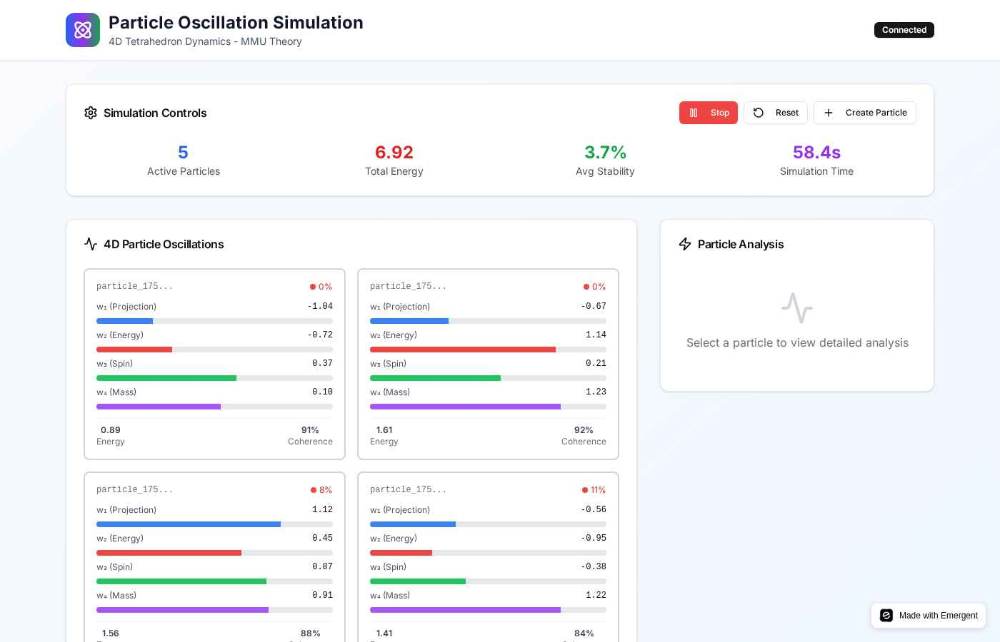
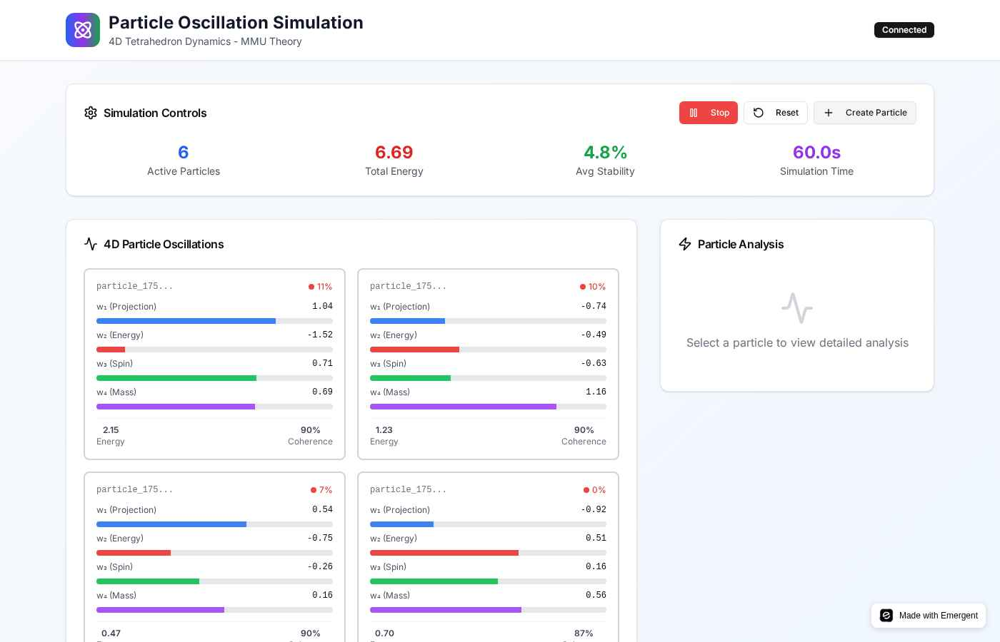
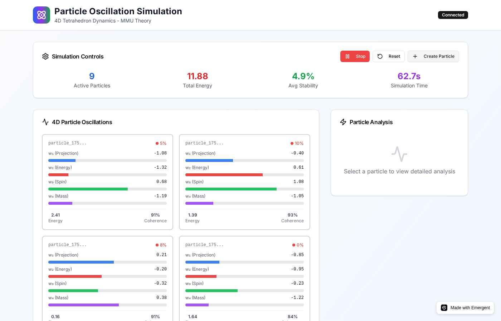
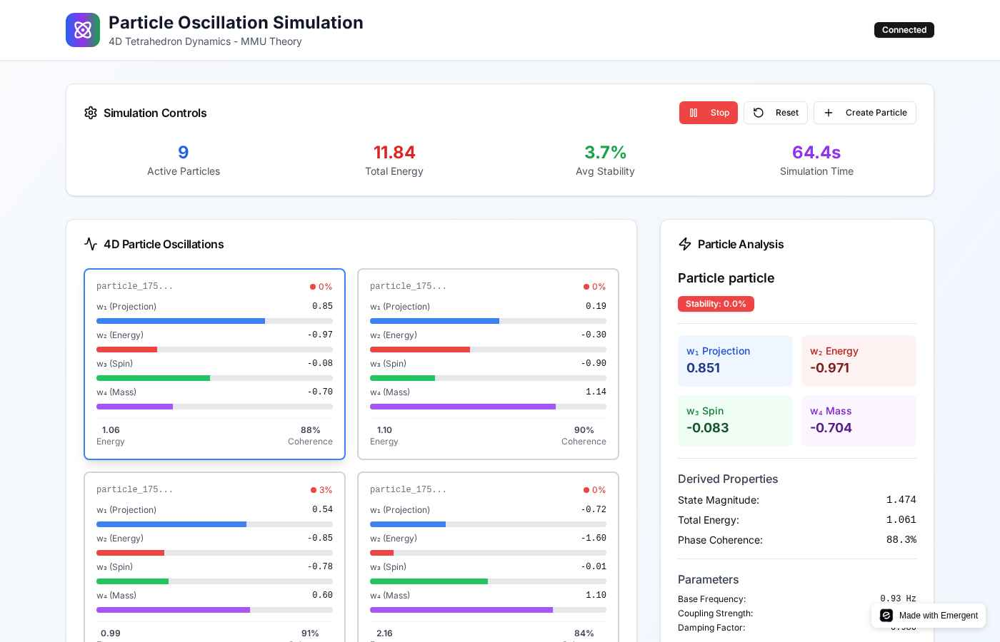

# Particle Oscillation Simulation

<div align="center">


**4D Tetrahedron Oscillation Dynamics Simulation**

*Berdasarkan Teori Methane Metauniverse (MMU)*

[](https://python.org)
[](https://fastapi.tiangolo.com)
[](https://php.net)
[](https://tailwindcss.com)
[](LICENSE)

[Demo Live](https://tetra-universe.preview.emergentagent.com) • [Dokumentasi](particle_oscillation/README.md) • [Paper MMU](https://osf.io/mk3xr/)

</div>

## Tentang Proyek

**Particle Oscillation Simulation** adalah implementasi real-time dari **4D tetrahedron oscillation dynamics** berdasarkan teori **Methane Metauniverse (MMU)** yang dikembangkan oleh Jürgen Wollbold. Aplikasi ini mensimulasikan getaran tetrahedron dalam empat dimensi (w₁-w₄) dengan visualisasi interaktif.

### 🔬 Dasar Ilmiah

Berdasarkan paper penelitian:
- **Judul**: "The Methane Metauniverse (MMU) A Geometric Explanation of Antiparticles, Entanglement, and Time"
- **Penulis**: Jürgen Wollbold  
- **DOI**: [10.17605/OSF.IO/MK3XR](https://osf.io/mk3xr/)
- **Tanggal**: August 2025

### Konsep Utama - 4D Oscillation

- **w₁ (Projection)**: Observable space projection - Visualisasi biru
- **w₂ (Energy)**: Energy input oscillation - Visualisasi merah  
- **w₃ (Spin)**: Spin angular momentum - Visualisasi hijau
- **w₄ (Mass)**: Mass projection dynamics - Visualisasi ungu

## Fitur Utama

### 4D Physics Engine
- **Real-time Oscillation**: Simulasi getaran w₁, w₂, w₃, w₄ dimensions secara real-time
- **Inter-dimensional Coupling**: Coupling antar dimensi berdasarkan teori MMU
- **Stability Calculations**: Kalkulasi faktor stabilitas berdasarkan keseimbangan dimensional
- **Phase Coherence**: Analisis konsistensi fase oscillation
- **Performance Monitoring**: Tracking FPS, energy, dan stabilitas sistem

### Interactive Interface  
- **4D Visualization**: Visualisasi real-time state tetrahedron dengan bar dimensional
- **Dual Backend Support**: Python (FastAPI) dan PHP backend support
- **Responsive Dashboard**: Interface modern dengan Tailwind CSS
- **Real-time Analytics**: Charts dan metrics untuk monitoring performa
- **Professional UI**: Desain modern dengan color-coded dimensions

### Technical Stack
- **Backend**: Python (FastAPI) + PHP (Alternative)
- **Frontend**: HTML5 + JavaScript + Tailwind CSS
- **Visualization**: Chart.js untuk real-time charts
- **Real-time**: WebSocket + HTTP polling fallback

## Screenshots

<div align="center">

### Main Interface - Particle Oscillation Simulation


### Single 4D Particle Visualization  


### Multiple Particles with 4D Dimensions


### Detailed Particle Analysis Panel


</div>

## Quick Start

### Prerequisites
- Python 3.8+
- Node.js 16+
- MongoDB 4.4+
- Yarn package manager

### Installation

1. **Clone Repository**
   ```bash
   git clone https://github.com/your-username/tetracore-server.git
   cd tetracore-server
   ```

2. **Setup Backend**
   ```bash
   cd backend
   pip install -r requirements.txt
   cp .env.example .env
   python server.py
   ```

3. **Setup Frontend**
   ```bash
   cd frontend
   yarn install
   cp .env.example .env
   yarn start
   ```

4. **Access Application**
   - Frontend: http://localhost:3000
   - Backend API: http://localhost:8001

**Untuk instalasi lengkap, lihat [INSTALL.md](INSTALL.md)**

## 🎮 Cara Penggunaan

### 1. Membuat Particles
- Klik tombol **"Create Particle"** untuk membuat tetrahedron baru
- Setiap particle memiliki 4 dimensi oscillation (w₁, w₂, w₃, w₄)
- Particle akan muncul dengan visualization bars untuk setiap dimensi

### 2. Menjalankan Simulasi
- Klik **"Start"** untuk memulai real-time oscillation simulation
- Amati perubahan dimensional values dan stability factors
- Monitor system metrics: Total Energy, Average Stability, FPS

### 3. Analisis Detail
- Klik pada particle untuk melihat detailed analysis panel
- Lihat detail 4D state values:
  - w₁ Projection (Blue) - Observable space projection
  - w₂ Energy (Red) - Energy input oscillation
  - w₃ Spin (Green) - Spin angular momentum  
  - w₄ Mass (Purple) - Mass projection dynamics

### 4. Management System
- **Delete**: Hapus particle individual dengan tombol delete
- **Reset**: Reset seluruh simulasi dan hapus semua particles
- **Backend Switch**: Pilih antara Python atau PHP backend
- **Real-time Config**: Adjust coupling strength dan environmental noise

## API Documentation

### Python Backend (FastAPI - Port 8001)
```http
GET    /api/status                    # Server status
GET    /api/simulation/state          # Full simulation state
POST   /api/simulation/start          # Start oscillation simulation
POST   /api/simulation/stop           # Stop simulation
POST   /api/simulation/reset          # Reset all particles
POST   /api/oscillators/create        # Create new particle
GET    /api/oscillators               # List all particles
DELETE /api/oscillators/{id}          # Remove particle
WS     /api/ws                        # WebSocket real-time updates
```

### PHP Backend (Port 8003)
```http
GET    /api.php/status                # Server status  
GET    /api.php/simulation/state      # Full simulation state
POST   /api.php/simulation/start      # Start simulation
POST   /api.php/oscillators/create    # Create new particle
DELETE /api.php/oscillators/{id}      # Remove particle
```

## Physics Implementation

### 4D Oscillation Equations
```python
# Base oscillations per dimension
w1 = amplitude_w1 * sin(2π * frequency * t + phase_w1)
w2 = amplitude_w2 * sin(2π * frequency * 1.2 * t + phase_w2)  
w3 = amplitude_w3 * sin(2π * frequency * 0.8 * t + phase_w3)
w4 = amplitude_w4 * sin(2π * frequency * 1.1 * t + phase_w4)

# Inter-dimensional coupling (MMU theory)
w1_coupled = w1 + coupling * (w2 * 0.3 + w4 * 0.2)
w2_coupled = w2 + coupling * (w3 * 0.4 + w1 * 0.1)
w3_coupled = w3 + coupling * (w2 * 0.5) + 0.3 * sin(6π * frequency * t)
w4_coupled = w4 + coupling * (w1 * 0.15)
```

### Stability Calculation
```python
def calculate_stability(state):
    magnitude = sqrt(w1² + w2² + w3² + w4²)
    
    # Ideal balance: 0.25 for each dimension
    w1_ratio = abs(w1) / magnitude
    w2_ratio = abs(w2) / magnitude  
    w3_ratio = abs(w3) / magnitude
    w4_ratio = abs(w4) / magnitude
    
    balance = 1.0 - abs(0.25 - w1_ratio) - abs(0.25 - w2_ratio) - 
              abs(0.25 - w3_ratio) - abs(0.25 - w4_ratio)
    
    return max(0, min(1, balance))
```

### Energy Calculation
```python
def calculate_energy(state, coupling):
    # Kinetic energy (oscillation amplitudes)
    kinetic = 0.5 * (w1² + w2² + w3² + w4²)
    
    # Potential energy (dimensional coupling)
    potential = 0.25 * coupling * (w1*w2 + w2*w3 + w3*w4 + w4*w1)
    
    return kinetic + potential
```

## Architecture

```
particle_oscillation/
├── backend_python/          # FastAPI backend
│   ├── oscillation_engine.py    # 4D physics engine
│   ├── api_server.py            # FastAPI REST API
│   └── requirements.txt         # Python dependencies
├── backend_php/             # PHP backend (alternative)
│   ├── oscillation_engine.php   # PHP physics engine
│   └── api.php                  # PHP REST API
├── frontend/                # Web interface
│   ├── index.html              # Main HTML page
│   └── js/oscillation-simulation.js  # JavaScript frontend
└── README.md               # Documentation
```

## Scientific Accuracy

### Methane Metauniverse Theory Implementation
- **4D Oscillation Dynamics**: w₁, w₂, w₃, w₄ dimensional oscillations
- **Inter-dimensional Coupling**: MMU theory-based coupling mechanisms  
- **Real-time Physics**: Accurate frequency and phase relationships
- **Stability Mechanics**: Dimensional balance calculations
- **Energy Conservation**: Proper kinetic + potential energy modeling

### Physics Calculations
- **Dimensional Oscillations**: Independent w₁-w₄ frequency patterns
- **Coupling Effects**: Cross-dimensional influence modeling
- **Phase Coherence**: Oscillation consistency analysis
- **System Metrics**: Real-time stability and energy tracking

## Contributing

Kami menyambut kontribusi untuk pengembangan simulasi ini:

1. **Fork** repository
2. **Create** feature branch (`git checkout -b feature/amazing-feature`)
3. **Commit** changes (`git commit -m 'Add amazing feature'`)
4. **Push** ke branch (`git push origin feature/amazing-feature`)
5. **Open** Pull Request

## References

1. Wollbold, J. (2025). "The Methane Metauniverse (MMU) A Geometric Explanation of Antiparticles, Entanglement, and Time." OSF. DOI: 10.17605/OSF.IO/MK3XR

2. [FastAPI Documentation](https://fastapi.tiangolo.com/)

3. [React Documentation](https://reactjs.org/docs/)

4. [MongoDB Documentation](https://docs.mongodb.com/)

## License

Project ini dilisensikan di bawah MIT License.

---

<div align="center">

** Advancing Theoretical Physics Through Interactive Simulation 🌌**

Made with ❤️ for the scientific community

</div>
